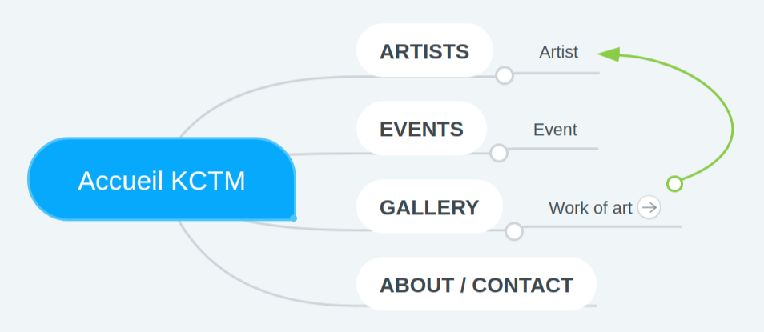

# Projet client: KomChéTaMère

## Client
Le Collectif KomChéTaMère est une asbl de promotion d'artiste et revalorisation de récup’ en tout genre qui a décidé de fonctionner selon trois grands principes : la consommation responsable, la diminution des déchets et l'alimentation durable.

## Thème

**Réalisation d'un site vitrine en vue de présenter l’asbl, les artistes et les oeuvres mises en avant au sein de son espace. Augmentation de la visibilité sur le net de l’asbl et mise en avant de projets et d’ artistes**

 ## **A quoi ça ressemble ?** 

## Structure

### *Techno*
Wordpress
Local de Flywheel
hébergement du site sur: http://www.komchetamere.be
Intégration d'une gestion des évènements par "calendrier"

